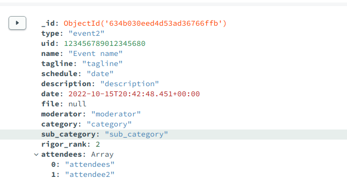
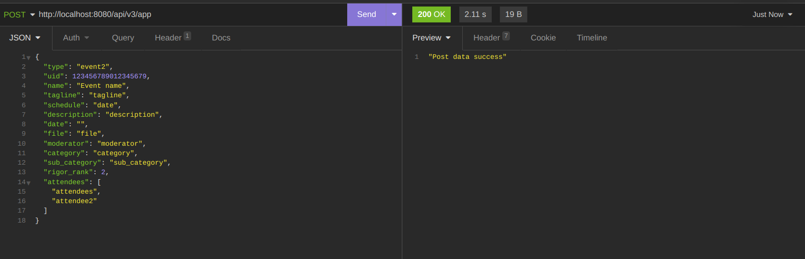
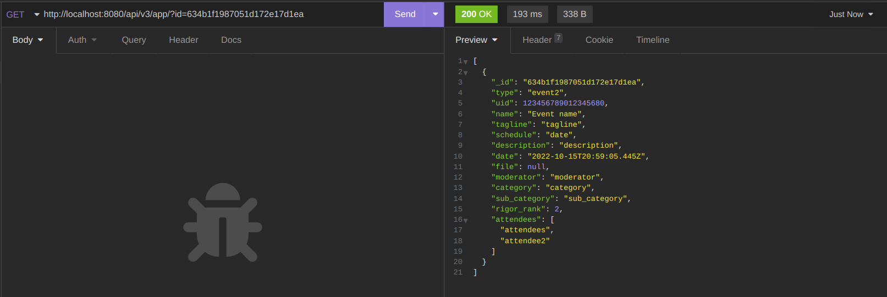
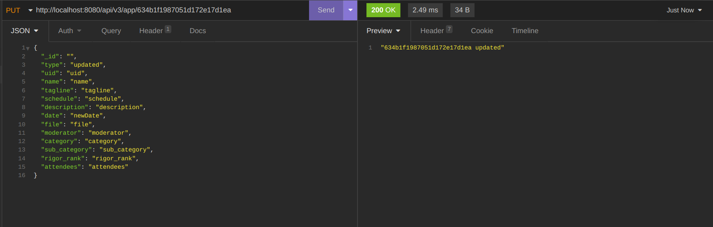
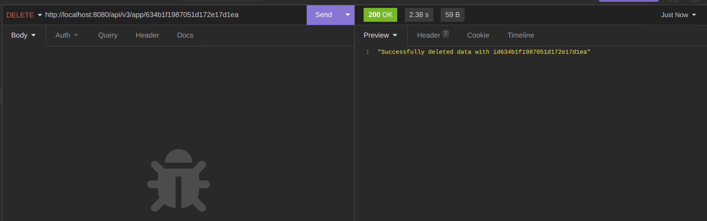

# Sample Data



# POST

```
//@desc Post an event
//@route Post /api/v3/app/:id
//@access Public
```



# GET

```
//@desc Get all events
//@route GET /api/v3/app/?id=_id
//@access Public
```



# PUT

```
//@desc Update an event
//@route PUT /api/v3/app/:id
//@access Public
```



# DELETE

```
//@desc Delete an event
//@route DELETE /api/v3/app/:id
//@access Public
```


